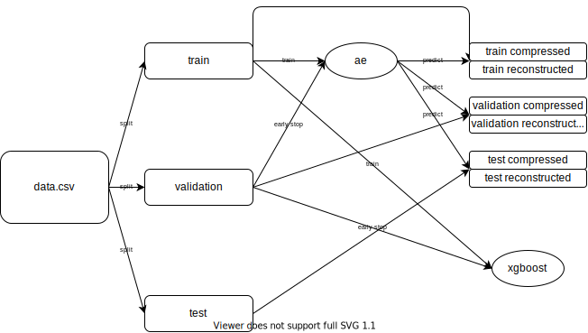
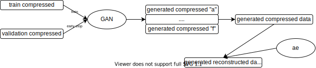
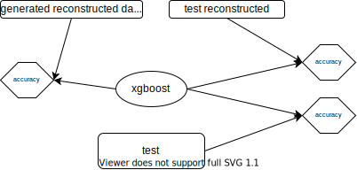

# LHCb PID Compression

In this repository, we compress PID data via autoencoder

## Pipeline description

First of all, we split data on train/validation/test and train autoencoder and xgboost

Then, we train GAN on compressed data (with given PIDs) and generate new data

Finally, we compute all accuracies

## How to run

1. Create `./data/` and `./data/input/` folder
2. Add `data.csv` to `./data/input/`
3. Configure `config.py`
4. Run `run_pipeline.sh` from `./scripts/`
5. Collect results from `./data/output/`